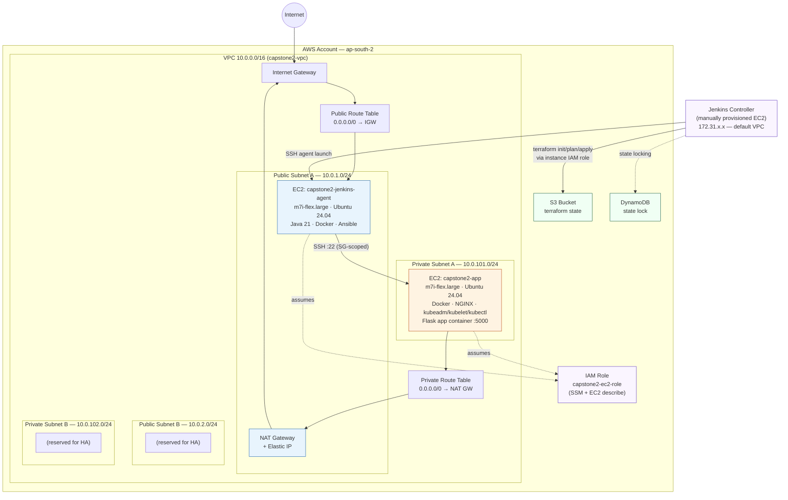
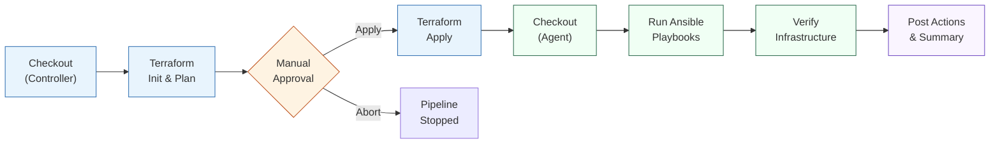

# Infrastructure Automation Platform — Capstone Project 2

[](https://www.terraform.io/)
[](https://www.ansible.com/)
[](https://www.jenkins.io/)
[](https://aws.amazon.com/)
[](https://www.docker.com/)

A fully automated **Infrastructure as Code** platform that provisions AWS infrastructure with Terraform, configures it with Ansible, and orchestrates the entire lifecycle through a Jenkins CI/CD pipeline — eliminating manual provisioning and configuration drift.

---

## Table of Contents

- [Overview](#overview)
- [Architecture](#architecture)
- [Repository Structure](#repository-structure)
- [Technology Stack](#technology-stack)
- [Infrastructure Components](#infrastructure-components)
- [Configuration Management](#configuration-management)
- [CI/CD Pipeline](#cicd-pipeline)
- [Getting Started](#getting-started)
- [Pipeline Walkthrough (Evidence)](#pipeline-walkthrough-evidence)
- [Security Design](#security-design)
- [Known Limitations](#known-limitations)
- [Author](#author)

---

## Overview

This project replaces manual, drift-prone cloud provisioning with a single, repeatable pipeline:

```
Terraform Plan → Manual Approval → Terraform Apply → Ansible Configuration → Infrastructure Verification
```

Every run provisions the same VPC, subnets, security groups, IAM roles, and EC2 instances; configures them identically via idempotent Ansible roles; and verifies the result before declaring success — all triggered from Jenkins with a single click.

---

## Architecture

### Network & Compute Topology



### CI/CD Pipeline Flow



**Why two execution nodes?** The Jenkins **Controller** (manually provisioned, holds AWS credentials via an attached IAM role) runs the Terraform stages. The Jenkins **Agent** (Terraform-provisioned, lives inside the target VPC, has Ansible + the SSH key + Python tooling installed) runs the Ansible and verification stages, since it can reach the private app subnet directly — the controller, sitting in a separate default VPC, cannot.

### End-to-End Flow (diagram)


---

## Repository Structure

```
DevOps-CapstoneProject2-Terraform/
├── terraform/                      # Bootstrap: S3 state bucket + DynamoDB lock table
│   ├── main.tf
│   ├── variables.tf
│   └── outputs.tf
├── modules/
│   ├── vpc/                        # VPC, subnets, IGW, NAT, route tables
│   ├── security-groups/            # Jenkins SG, App SG (least-privilege)
│   ├── iam/                        # EC2 instance role + SSM + describe policy
│   └── ec2/                        # Jenkins agent + App instance
├── environments/
│   └── dev/                        # Root module: wires all child modules together
│       ├── backend.tf              # Remote S3 backend + DynamoDB locking
│       ├── main.tf
│       ├── variables.tf
│       ├── outputs.tf
│       └── providers.tf
├── ansible/
│   ├── ansible.cfg
│   ├── inventory/
│   │   └── aws_ec2.yml             # Dynamic inventory (AWS EC2 plugin, tag-grouped)
│   ├── roles/
│   │   ├── common/                 # Base packages, updates
│   │   ├── java/                   # OpenJDK 21
│   │   ├── git/                    # Git
│   │   ├── docker/                 # Docker Engine + Compose plugin
│   │   ├── nginx/                  # NGINX reverse proxy
│   │   ├── k8s_prereqs/            # kubeadm/kubelet/kubectl + kernel/sysctl prep
│   │   ├── jenkins_agent/          # SSH-based Jenkins agent working directory
│   │   └── app_deploy/             # Builds & runs the containerized app
│   └── playbooks/
│       └── site.yml                # Consolidated playbook — all roles, all hosts
├── app/                            # Flask application source + Dockerfile
│   ├── app.py
│   ├── requirements.txt
│   └── Dockerfile
├── screenshots/                    # Pipeline execution evidence (see below)
├── Jenkinsfile                     # Full CI/CD pipeline definition
└── README.md
```

---

## Technology Stack

| Layer | Tool | Purpose |
|---|---|---|
| Provisioning | **Terraform** ~1.5+, AWS provider ~5.0 | VPC, subnets, EC2, IAM, security groups |
| State management | **S3 + DynamoDB** | Remote state storage with locking (prevents concurrent-apply conflicts) |
| Configuration | **Ansible** | Idempotent server configuration via roles |
| Inventory | **amazon.aws.aws_ec2** dynamic inventory plugin | Auto-discovers EC2 instances by tag, no hardcoded IPs |
| Orchestration | **Jenkins** (Declarative Pipeline) | Plan → Approve → Apply → Configure → Verify |
| Containerization | **Docker** | Application packaging and runtime |
| Reverse proxy | **NGINX** | Routes external traffic to the containerized app |
| Application | **Python / Flask** | Demo service with a `/health` endpoint for verification |

---

## Infrastructure Components

### Networking (`modules/vpc`)
- 1 VPC (`10.0.0.0/16`)
- 2 public subnets across 2 Availability Zones (`10.0.1.0/24`, `10.0.2.0/24`)
- 2 private subnets across 2 Availability Zones (`10.0.101.0/24`, `10.0.102.0/24`)
- 1 Internet Gateway (public egress/ingress)
- 1 NAT Gateway + Elastic IP (private subnet outbound-only internet access)
- Separate public/private route tables with correct associations

### Security (`modules/security-groups`, `modules/iam`)
- **Jenkins SG**: SSH (22) and Jenkins UI (8080) restricted to the admin's IP and the controller's IP — never `0.0.0.0/0`
- **App SG**: SSH allowed only *from the Jenkins security group* (not a CIDR) — app servers are unreachable except through the agent; HTTP allowed within the VPC CIDR only
- **IAM role**: least-privilege — `AmazonSSMManagedInstanceCore` for Session Manager access, plus a scoped inline policy for `ec2:Describe*` (used only by Ansible's dynamic inventory)

### Compute (`modules/ec2`)
- **Jenkins Agent** — public subnet, `m7i-flex.large`, Ubuntu 24.04 (latest AMI resolved dynamically via data source)
- **App Server** — private subnet, same spec, no public IP
- Both: 20 GB gp3 root volumes, IAM instance profile attached, tagged for dynamic inventory discovery

### State Management
- Terraform state stored remotely in **S3** (versioned, encrypted, public access blocked)
- State locking via **DynamoDB** — prevents two people/pipelines from applying simultaneously
- Bootstrap resources (the bucket and table themselves) are managed in their own `terraform/` root, imported into state rather than causing a chicken-and-egg dependency

---

## Configuration Management

All configuration is idempotent — running `site.yml` repeatedly converges to the same state without unintended side effects.

| Role | What it does |
|---|---|
| `common` | Updates apt cache, upgrades packages, installs base utilities |
| `java` | Installs OpenJDK 21 (matched to the Jenkins controller's version to avoid agent handshake failures) |
| `git` | Installs Git |
| `docker` | Installs Docker Engine + Compose plugin from Docker's official repo; adds `ubuntu` to the `docker` group |
| `nginx` | Installs and starts NGINX, deploys a baseline health page |
| `k8s_prereqs` | Disables swap, loads `overlay`/`br_netfilter` kernel modules, sets required sysctl params, installs `kubeadm`/`kubelet`/`kubectl` (held at fixed version) |
| `jenkins_agent` | Prepares the SSH-launched Jenkins agent's working directory |
| `app_deploy` | Copies app source, builds the Docker image, runs the container, configures NGINX as a reverse proxy, verifies `/health` responds `200` |

### Dynamic Inventory

Instead of static IP lists, Ansible discovers hosts live from AWS, grouped by the `Role` tag Terraform applies:

```yaml
plugin: amazon.aws.aws_ec2
regions: [ap-south-2]
filters:
  tag:Project: capstone2
  instance-state-name: running
keyed_groups:
  - key: tags.Role
    prefix: tag_Role
compose:
  ansible_host: private_ip_address
```

This means `tag_Role_jenkins_agent` and `tag_Role_app` groups always reflect current infrastructure — no manual inventory updates when instances are replaced.

---

## CI/CD Pipeline

Defined in [`Jenkinsfile`](./Jenkinsfile) as a Declarative Pipeline with **7 stages**:

1. **Checkout (Controller)** — pulls the repo onto the Jenkins controller
2. **Terraform Init & Plan** — initializes the remote backend, produces a plan
3. **Manual Approval** — pipeline pauses; a human reviews the plan and clicks *Apply* or *Abort*
4. **Terraform Apply** — applies the approved plan
5. **Checkout (Agent)** — pulls the repo onto the Jenkins agent (inside the target VPC)
6. **Run Ansible Playbooks** — executes `site.yml` against the live, dynamically-discovered inventory
7. **Verify Infrastructure** — EC2 reachability (`ansible -m ping`), application health check (`curl /health`), NGINX/Docker service status, and container state

Terraform inputs (`admin_cidr`, `key_name`, `jenkins_controller_cidr`) are supplied via `TF_VAR_*` environment variables in the Jenkinsfile rather than a committed `terraform.tfvars` — keeping secrets/environment-specific values out of version control while still working in a non-interactive pipeline.

---

## Getting Started

### Prerequisites
- AWS account with sufficient permissions (VPC, EC2, IAM, S3, DynamoDB)
- Terraform >= 1.5
- Ansible >= 2.15 with the `amazon.aws` and `community.docker` collections
- Jenkins with an SSH-launched agent node

### 1. Bootstrap the remote backend
```bash
cd terraform
terraform init
terraform apply -var="state_bucket_name=<your-unique-bucket-name>"
```

### 2. Provision infrastructure
```bash
cd ../environments/dev
terraform init
terraform plan
terraform apply
```

### 3. Configure servers
```bash
cd ../../ansible
ansible-galaxy collection install amazon.aws community.docker community.general
ansible-inventory --list         # confirm both hosts are discovered
ansible-playbook playbooks/site.yml
```

### 4. Run via Jenkins (recommended)
Point a Jenkins Pipeline job at this repository with **Script Path**: `Jenkinsfile`, then **Build Now**. The pipeline handles all of the above automatically, with a manual approval gate before any infrastructure change is applied.

---

## Pipeline Walkthrough (Evidence)

### End-to-end Stage View
A full pipeline run, all 7 stages green:


### 1 — Checkout (Controller)
The controller pulls the latest commit before planning:


### 2 — Manual Approval Gate
The pipeline pauses after `terraform plan` and waits for explicit human sign-off — satisfying the brief's approval-gate requirement:


### 3 — Checkout (Agent)
The Jenkins agent (running inside the target VPC) independently checks out the same commit before configuring hosts:


### 4 — Ansible Configuration Run
`site.yml` executing against the dynamically-discovered inventory — note the `PLAY RECAP` with zero failures across both hosts:


### 5 — Application Health Verification
The pipeline's Verify stage confirming the containerized Flask app responds correctly through NGINX:


### 6 — Infrastructure Validation
EC2 reachability check as part of the Verify Infrastructure stage:


### 7 — NGINX Configured via Ansible
Confirming NGINX is live and serving content, entirely provisioned by Ansible with no manual server access:


### 8 — Post-Pipeline Summary
Final pipeline confirmation message:


### Jenkins Agent Node
The SSH-launched agent, registered and online, ready to execute Ansible/verification stages:


### Supporting AWS Console Evidence

| Resource | Evidence |
|---|---|
| EC2 Instances (Jenkins agent + App server, both `Running`) |  |
| Elastic IP bound to the NAT Gateway |  |
| Internet Gateway, attached to the VPC |  |
| Route tables (public → IGW, private → NAT) |  |

---

## Security Design

- **No security group ever opens SSH/8080 to `0.0.0.0/0`** — access is scoped to specific admin/controller IPs or, for inter-tier traffic, to source security groups rather than CIDRs
- **Private app subnet has no public IP** — the app server is only reachable through the Jenkins agent, which itself is IP-restricted
- **IAM least privilege** — the EC2 instance role grants only SSM access and read-only EC2 describe permissions, not broad administrative access
- **Encrypted, versioned, access-blocked state bucket** — S3 state storage uses AES-256 encryption, versioning (for recovery), and blocks all public access
- **State locking** — DynamoDB prevents concurrent `terraform apply` runs from corrupting state
- **Secrets kept out of version control** — `terraform.tfvars`, `.terraform/`, and state files are gitignored; pipeline-time values are injected via environment variables

---

## Known Limitations

- **Terraform workspaces** for dev/prod separation are not yet implemented — the project currently uses a single `environments/dev` root module. A `prod` workspace/environment following the same module pattern is a natural next step.
- The Jenkins controller was provisioned manually (outside Terraform) per the assignment's starting constraints, and lives in a separate default VPC from the Terraform-managed infrastructure, connected via public IP + security-group-scoped SSH rather than VPC peering.
- `admin_cidr` and `jenkins_controller_cidr` are hardcoded as pipeline environment variables rather than sourced from Jenkins Credentials or SSM Parameter Store; on a residential/dynamic IP this requires a manual update before re-running the pipeline.
- No automated `terraform destroy` stage — teardown is currently a manual step.

---

## Author

**Muhammed Musthafa**
Repository: [DevOps-CapstoneProject2-Terraform](https://github.com/muhammedmusthafatp/DevOps-CapstoneProject2-Terraform)
